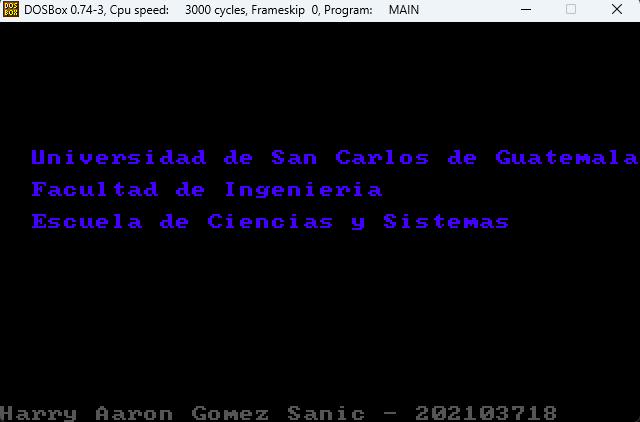
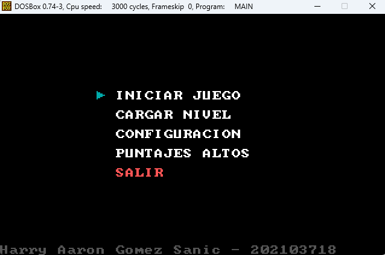
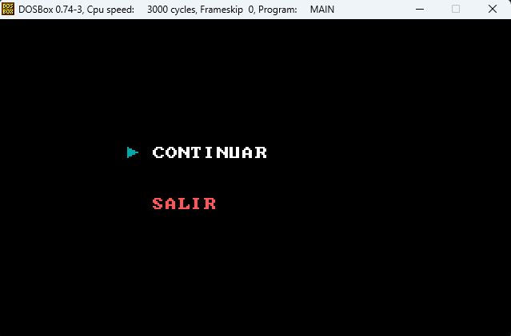
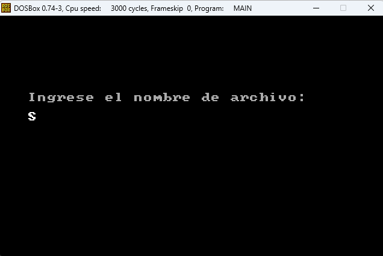

# **MANUAL DE USUARIO** 🕹️

 

## **Introducción** 📑

Con la finalidad de la implementación del lenguaje ensamblador, el curso arquitectura de computadores y ensambladores 1 se llevó a cabo el juego japonés Sokoban, en el cual el jugador tiene como principal objetivo empujar una serie de pescados hasta conseguir que éstos se ubiquen en ciertas posiciones. Cuando el jugador consigue lo anterior se le permite avanzar de nivel y acumular más puntos.

___

 

## **DESCRIPCION DEL SISTEMA** 📄

 

## *Acceso al sistema:*
Al iniciar el programa, será necesario verificar la presencia de los archivos `NIV.00`, `NIV.01` y `NIV.10` ya que tienen la configuración de los niveles base dentro del juego.

 

## *Ejecución*
1. Abrir DOSBox
2. Entrar al directorio `ACE1-23VJ0778202103718PROY2/src`
2. Compilar el archivo `main.asm` con el comando `ml main.asm`
3. Ejecutar el archivo `main.exe` con el comando `main.exe`

 

## *Mensaje Inicial🏛️*
Se muestra un encabezado y el nombre del programador

 

## *Menú Principal🏛️*
En el menú principal se puede seleccionar entre las siguientes opciones:
- Iniciar Juego
- Cargar Nivel
- Configuración
- Puntajes Altos

 

___

 

* ## *Menú Pausa*
Se dará la opción, desde el menú principal a acceder a un menú de configuración. Este menú servirá principalmente para configurar los controles del juego. En la Figura 4 se ejemplifica el diseño de este menú.

 

* ## *Cargar Nivel*
Se podrá cargar un nivel aparte de los 3 niveles que trae el juego como base, ingresando de la siguiente forma: `NombreArchivo.TXT`

 

* ## *Jugabilidad*
Cada nivel contará con diferentes dificultadores y se maneja por medio de las flechas del teclado para mover los pescados.

 

___

 

~~~
Universidad de San Carlos de Guatemala 2023
Programador: Harry Aaron Gómez Sanic
Carné: 202103718
~~~

 

___